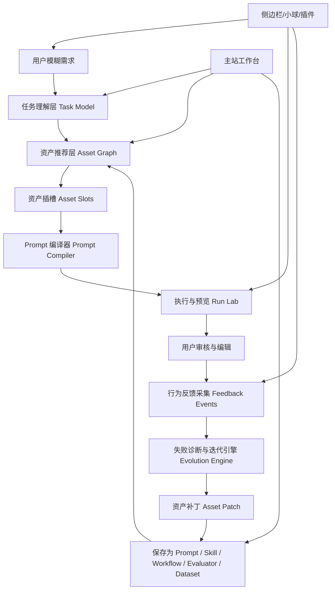

# 提示词大师 Pro 2.0 产品迭代方案

## 0. 一句话定位

提示词大师 Pro 2.0 不是“帮用户写一段 Prompt 的网站”，而是一个本地优先、资产驱动、可自动迭代的提示词工程系统。

它把人的模糊需求、业务知识、任务规则、工具能力、输入资料和验收标准，封装成 AI 可执行、人可审核、可版本化、可复用、可评估的中间产物。这个中间产物可以是 Prompt，也可以升级为 Skill、Workflow、Agent、MCP、SDK 接入说明、Evaluator、Dataset 或完整资产包。

核心转变：

```text
用户不会写 Prompt
↓
系统理解任务意图
↓
推荐并插入资产包
↓
编译成可执行 Prompt / Skill / Workflow
↓
AI 执行
↓
采集用户后续行为
↓
诊断失败原因
↓
自动生成迭代建议或资产补丁
↓
沉淀为新的 Prompt / Skill / Evaluator / Policy / Dataset
```

## 1. 2.0 的核心判断

### 1.1 Prompt 不是结果，而是任务封装层

很多产品把 Prompt 当成最终交付物：用户输入一句需求，系统生成一段高级 Prompt，然后让用户复制。

这个链路太浅。真正的 Prompt 工程应该是：

```text
人的模糊需求
↓
结构化任务理解
↓
Prompt / Skill / Workflow 封装
↓
AI 执行
↓
人审核结果
↓
反馈优化 Prompt
```

Prompt 是连接“人想做什么”和“AI 怎么干活”的中间接口。它本质上是指令资产，不是终点。

### 1.2 用户真正不会的不是“写句子”，而是“封装任务”

用户不会写 Prompt 的背后通常是：

- 不知道如何描述任务目标。
- 不知道输入资料要怎么组织。
- 不知道输出格式要怎么约束。
- 不知道何时该用 Prompt，何时该升级为 Skill。
- 不知道 MCP、SDK、Tool、Agent 的边界。
- 不知道怎么评估生成结果。
- 不知道失败后该改 Prompt、补资料、加 Policy、加 Dataset，还是换模型。

所以 2.0 不能只做 Prompt 改写器，而要做“任务封装系统”。

### 1.3 反馈不能停留在点赞点踩

Prompt 迭代最有价值的信号不是：

- 点赞。
- 点踩。
- 满意。
- 不满意。

这些信号太粗。真正有价值的是用户后续行为：

- 用户有没有手动修改 AI 输出。
- 修改了哪些位置。
- 是否继续追问“不是这个意思”。
- 是否复制、保存、提交或发送结果。
- 是否切换 Prompt。
- 是否切换模型。
- 是否补充资料。
- 是否反复要求“更具体”“用表格”“不要编造”。
- 是否把结果标记为可复用模板。
- 是否多次上传同类资料。

这些行为可以反推 Prompt 的问题：

- 用户总要求表格：输出格式约束不足。
- 用户总追问更具体：颗粒度要求不足。
- 用户经常删除 AI 编造事实：Reference 和 Policy 不足。
- 用户总补同类资料：Prompt 应升级为 Skill 或 Workflow。
- 用户执行后不复制：输出不可用或不符合场景。

### 1.4 产品形态应该分成两层

最合理的不是只做网站，也不是只做小球，而是两层：

```text
主站 / 工作台：资产管理、构建、编辑、版本、评估、知识库。
侧边栏 / 小球 / 插件：真实场景入口、上下文识别、快速调用、行为反馈。
```

主站是资产库和工程驾驶舱。

侧边栏/小球是真实使用入口和反馈采集器。

这样才闭环：主站负责“资产沉淀”，侧边栏负责“实际使用”，反馈系统负责“自动进化”。

## 2. 产品愿景

### 2.1 目标用户

1. 普通用户：不会写 Prompt，但想让 AI 帮自己完成工作。
2. Prompt 进阶用户：会写 Prompt，但缺少资产管理、评估、复用和自动迭代。
3. 团队负责人：希望沉淀团队可复用工作方法、规范和模板。
4. 开发者：需要把 SDK、MCP、Agent、Workflow 封装成可被 AI 调用的工程上下文。
5. AI 产品构建者：想从 Prompt 资产逐步升级到 Skill、Agent、工具流和评估体系。

### 2.2 核心价值

- 让不会写 Prompt 的人也能得到可执行提示词。
- 让会写 Prompt 的人能把提示词沉淀为可复用资产。
- 让 Prompt 不是一次性文本，而是可以被评估、版本化、组合和自动迭代的工程资产。
- 让 Skill、MCP、SDK、Agent、Workflow 不再是抽象概念，而是有向导、有结构、有校验、有示例的可创建资产包。
- 让用户真实使用行为反哺资产库，使系统越用越懂用户。

### 2.3 产品北极星指标

不是“生成了多少 Prompt”，而是：

```text
高质量 AI 任务封装被成功复用的次数。
```

可拆成：

- 资产复用次数。
- 生成结果被复制/保存/提交/发送的比例。
- 用户手动修改率下降。
- 同类任务二次完成时间下降。
- Prompt 自动迭代后评估分提升。
- 从 Prompt 升级为 Skill/Workflow 的数量。

## 3. 2.0 产品总架构



### 3.1 九层系统

1. **任务理解层**：把自然语言需求解析成目标、受众、输入、输出、风险和验收标准。
2. **资产图谱层**：管理 Prompt、Skill、MCP、SDK、Workflow 等 16 类资产及其关系。
3. **资产插槽层**：允许用户随心插入资产包，并处理冲突、优先级和上下文预算。
4. **Prompt 编译层**：把任务模型和资产包编译成最终 Prompt 或 Skill/Workflow 规格。
5. **执行实验层**：运行 Prompt，预览输出，进行 A/B 测试、模型切换和评分。
6. **行为反馈层**：采集用户真实后续行为，而不是只收集点赞点踩。
7. **迭代引擎层**：诊断失败原因，生成 Prompt/Asset Patch。
8. **资产生成器层**：帮助用户创建 Prompt、Skill、MCP、SDK、Agent 等资产。
9. **治理与安全层**：处理 Policy、权限、敏感数据、工具边界和导入审查。

## 4. 核心产品模块

### 4.1 任务理解画布

#### 目标

把用户一句模糊需求变成结构化任务卡。

#### 输入

```text
帮我写一个能让 AI 分析合同风险的提示词。
```

#### 输出任务卡

```json
{
  "goal": "分析合同风险",
  "audience": "业务/法务审核人员",
  "inputMaterials": ["合同文本", "业务背景", "重点条款"],
  "expectedOutput": ["风险清单", "条款位置", "风险等级", "修改建议"],
  "constraints": ["不得编造条款", "不替代正式法律意见", "缺少资料时先列问题"],
  "riskLevel": "high",
  "suggestedAssetTypes": ["prompt", "reference", "policy", "evaluator", "template"]
}
```

#### 关键能力

- 自动识别任务类型。
- 自动识别高风险领域。
- 自动建议需要哪些资产。
- 自动生成缺失信息问题。
- 自动判断是否应该从 Prompt 升级为 Skill/Workflow。

### 4.2 资产图谱与资产插槽

#### 目标

让用户不是“选择一个 Prompt”，而是像搭积木一样插入资产包：

```text
Prompt 基底
+ Skill 工作方法
+ Reference 领域资料
+ Policy 安全边界
+ Template 输出格式
+ Evaluator 评估标准
+ Dataset 示例
+ MCP/SDK/Tool 工具上下文
```

#### 资产插槽

每次优化任务默认有这些插槽：

| 插槽 | 作用 | 推荐资产 |
| --- | --- | --- |
| 任务骨架 | 定义角色、任务、输出 | Prompt / Template |
| 工作方法 | 定义执行步骤和质量门 | Skill / Workflow |
| 领域事实 | 提供术语、规范和资料 | Reference / Memory |
| 工具能力 | 定义可用工具和接口 | MCP / SDK / Tool / Connector |
| 约束边界 | 定义安全、合规和拒答 | Policy |
| 示例样本 | 提供 few-shot 和反例 | Dataset |
| 评估标准 | 定义好坏和通过阈值 | Evaluator / Benchmark |

#### 创新点

- 资产不只是列表，而是带关系的图谱。
- 系统能解释为什么推荐某个资产。
- 插入资产后可看到 Prompt 的哪一段被它影响。
- 支持“一键降噪”：把长资产压缩成可注入摘要。
- 支持冲突提示：比如两个 Policy 规则冲突、两个 Template 输出格式冲突。

### 4.3 Prompt 编译器

#### 目标

把任务模型和资产包编译成不同形态的高质量中间产物。

#### 编译输入

- 用户需求。
- 任务模型。
- 场景和风格。
- 优化方向。
- 用户确认资产。
- 推荐但未确认资产。
- 附件和上下文。
- 历史反馈。

#### 编译输出

1. **Readable Prompt**：给人看的清晰 Prompt。
2. **Strict Prompt**：强约束、强格式、适合生产任务。
3. **Tool-ready Prompt**：包含工具调用策略。
4. **Agent-ready Prompt**：包含目标、计划、工具、停止条件。
5. **Eval-ready Prompt**：自带评估标准和输出检查。
6. **Skill Draft**：当任务高频复杂时，自动生成 Skill 草稿。
7. **Workflow Draft**：当任务多阶段时，自动生成 Workflow 草稿。

#### Prompt IR

2.0 应引入 Prompt Intermediate Representation：

```ts
interface PromptIR {
  task: TaskModel;
  sections: {
    role: string;
    context: string[];
    inputs: string[];
    process: string[];
    toolRules: string[];
    constraints: string[];
    outputFormat: string;
    evaluationCriteria: string[];
    fallback: string[];
  };
  assetBindings: {
    assetId: string;
    slot: string;
    appliedToSections: string[];
    priority: number;
  }[];
  risks: string[];
  assumptions: string[];
}
```

IR 的价值：

- Prompt 不再是不可解释的大段文本。
- 可以显示每个资产影响了哪一段。
- 可以做 diff、评分、回滚和局部重编译。
- 未来能导出为 OpenAI/Anthropic/Gemini 不同格式。

### 4.4 资产包生成器

#### 目标

解决用户不会做 Skill、MCP、SDK、Workflow 的问题。

#### 每类资产都提供向导

##### Prompt 生成器

输入：

- 任务描述。
- 受众。
- 输出格式。
- 示例。
- 反例。

输出：

- PromptAsset。
- PromptIR。
- Evaluator 草稿。

##### Skill 生成器

输入：

- 任务类型。
- 触发条件。
- 执行步骤。
- 参考资料。
- 可用脚本/工具。

输出：

- SkillAsset。
- `SKILL.md` 草稿。
- references/scripts/assets/mcp 目录建议。
- validation checklist。

##### MCP 生成器

输入：

- 服务名称。
- 可用工具。
- 参数和返回。
- 权限和认证。
- 失败处理。

输出：

- McpAsset。
- tool schema。
- security notes。
- 只读评估问题。

##### SDK 生成器

输入：

- 官方文档链接或代码片段。
- 包名和语言。
- 初始化方式。
- 方法清单。

输出：

- SdkAsset。
- 核心方法表。
- 最小示例。
- 测试建议。

##### Workflow 生成器

输入：

- 目标。
- 阶段。
- 输入输出。
- 人工确认点。
- 失败处理。

输出：

- WorkflowAsset。
- Mermaid 流程图。
- 质量门。

#### 从真实使用中生成资产

最重要的不是让用户从空白表单创建资产，而是从行为中沉淀：

- “这次 Prompt 用了 5 次，是否沉淀为 Skill？”
- “你连续 3 次补充同一份资料，是否保存为 Reference？”
- “你总是要求表格输出，是否保存为 Template？”
- “你经常删除未标注来源的内容，是否添加 Policy？”
- “你总是让 AI 改得更口语，是否保存为 Memory 偏好？”

### 4.5 执行实验室 Run Lab

#### 目标

让 Prompt 在保存前可以被测试，而不是只靠肉眼看。

#### 能力

- 单输入试跑。
- 多输入批量试跑。
- A/B 测试。
- 多模型对比。
- 资产开关对比。
- 输出评分。
- 引用检查。
- 格式检查。
- 安全检查。
- 历史版本对比。

#### 推荐界面

```text
左侧：Prompt / IR / 资产插槽
中间：测试输入和输出
右侧：评分、失败原因、迭代建议
底部：版本时间线
```

### 4.6 行为反馈与自动迭代引擎

#### 目标

让系统从真实使用中自动发现 Prompt 的问题。

#### FeedbackEvent

```ts
type FeedbackEventType =
  | 'manual_edit'
  | 'copy_result'
  | 'save_result'
  | 'submit_result'
  | 'regenerate'
  | 'follow_up'
  | 'switch_prompt'
  | 'switch_model'
  | 'add_attachment'
  | 'delete_output_fragment'
  | 'mark_reusable'
  | 'create_asset_from_run';

interface FeedbackEvent {
  id: string;
  runId: string;
  type: FeedbackEventType;
  payload: Record<string, unknown>;
  timestamp: number;
}
```

#### 失败诊断规则

| 用户行为 | 可能问题 | 推荐补丁 |
| --- | --- | --- |
| 多次要求“用表格” | 输出格式约束不足 | 更新 Template / Prompt.outputFormat |
| 多次要求“更具体” | 颗粒度不足 | 更新 evaluationCriteria |
| 删除无来源内容 | 编造风险 | 添加 Policy / Reference citationRules |
| 每次上传同类资料 | 任务可 Skill 化 | 生成 Skill / Parser |
| 切换模型才可用 | Prompt 对模型依赖强 | 增加兼容性约束 |
| 复制率低 | 输出不可执行 | 增强 actionability |
| 保存后又频繁编辑 | Prompt 尚未稳定 | 生成 Benchmark |

#### 自动迭代流程

```text
执行结果
↓
采集行为
↓
分析 edit diff / follow-up / copy status
↓
归因到 Prompt / Reference / Policy / Template / Dataset
↓
生成 AssetPatch
↓
用户确认
↓
保存新版本
↓
跑回归测试
```

#### AssetPatch

```ts
interface AssetPatch {
  id: string;
  targetAssetId: string;
  reason: string;
  evidenceEvents: string[];
  changes: {
    fieldPath: string;
    before: string;
    after: string;
  }[];
  expectedImpact: string;
  risk: string;
}
```

### 4.7 侧边栏 / 小球 / 浏览器插件

#### 定位

侧边栏不是完整资产库，而是真实场景入口。

它适合：

- 快速唤起。
- 识别当前页面/文档/聊天上下文。
- 推荐 Prompt 或 Skill。
- 执行轻量任务。
- 收集用户后续行为。
- 生成迭代建议。

它不适合：

- 深度编辑复杂资产。
- 批量管理资产。
- 长流程评估。
- 团队级治理。

#### 推荐能力

1. 当前页面上下文识别。
2. 快速选择资产。
3. 一键生成任务 Prompt。
4. 一键把当前网页/对话/文档保存为 Reference。
5. 一键把重复任务沉淀为 Skill。
6. 执行后提示迭代建议。
7. 行为反馈同步到主站。

#### 形态差异

| 形态 | 最适合做什么 | 不适合做什么 |
| --- | --- | --- |
| 主站 | 资产管理、构建、评估、版本 | 即时上下文捕获 |
| 侧边栏 | 网页/文档/AI 对话中的调用 | 承载复杂资产编辑 |
| 悬浮小球 | 快速唤起、轻量推荐、随手反馈 | 深度构建和批量管理 |
| 插件/Extension | 跨网站采集上下文和执行数据 | 需要处理权限和隐私 |

## 5. 2.0 信息架构

### 5.1 顶部导航

```text
工作台
资产库
构建器
运行实验室
反馈洞察
知识库
设置
```

### 5.2 工作台

核心目标：从用户需求生成可执行 Prompt。

模块：

- 需求输入。
- 任务理解卡。
- 资产推荐。
- 资产插槽。
- 编译模式。
- 输出预览。
- highlights。
- 下一步建议。

### 5.3 资产库

核心目标：管理资产。

模块：

- 类型筛选。
- 语义搜索。
- 资产图谱。
- 版本历史。
- 来源和可信度。
- 关联资产。
- 导入导出。

### 5.4 构建器

核心目标：帮助用户创建不会做的资产。

模块：

- Prompt Builder。
- Skill Builder。
- MCP Builder。
- SDK Builder。
- Workflow Builder。
- Agent Builder。
- Evaluator Builder。
- Dataset Builder。

### 5.5 运行实验室

核心目标：测试 Prompt 和资产组合。

模块：

- 测试输入集。
- 版本对比。
- 多模型对比。
- 资产开关对比。
- 评分报告。
- 失败归因。

### 5.6 反馈洞察

核心目标：根据用户行为发现 Prompt 问题。

模块：

- 运行记录。
- 用户编辑 diff。
- 高频追问。
- 复制/保存/提交行为。
- 失败归因。
- 自动补丁。
- 可沉淀资产建议。

## 6. 数据模型升级

### 6.1 TaskModel

```ts
interface TaskModel {
  id: string;
  rawInput: string;
  goal: string;
  audience: string;
  scenario: string;
  inputMaterials: string[];
  expectedOutputs: string[];
  constraints: string[];
  risks: string[];
  missingInfo: string[];
  suggestedAssetTypes: AssetType[];
  createdAt: number;
}
```

### 6.2 PromptCompilation

```ts
interface PromptCompilation {
  id: string;
  taskId: string;
  mode: 'readable' | 'strict' | 'tool-ready' | 'agent-ready' | 'eval-ready';
  promptIR: PromptIR;
  compiledPrompt: string;
  assetIds: string[];
  warnings: string[];
  createdAt: number;
}
```

### 6.3 PromptRun

```ts
interface PromptRun {
  id: string;
  compilationId: string;
  model: string;
  input: string;
  output: string;
  metrics: Record<string, number>;
  feedbackEvents: FeedbackEvent[];
  createdAt: number;
}
```

### 6.4 AssetGraphEdge

```ts
interface AssetGraphEdge {
  id: string;
  sourceAssetId: string;
  targetAssetId: string;
  relation:
    | 'uses'
    | 'evaluates'
    | 'constrains'
    | 'provides_context'
    | 'implements'
    | 'tests'
    | 'derived_from'
    | 'conflicts_with';
  note: string;
}
```

### 6.5 Storage

v2 本地优先仍然成立，但建议从纯 localStorage 逐步升级：

1. v2.0：继续 localStorage，新增 namespace 和导入导出。
2. v2.1：IndexedDB 保存运行记录、diff、批量样例和大资产内容。
3. v2.2：可选本地 SQLite 或文件夹工作区。
4. v3.0：团队协作和云同步。

## 7. AI 编排能力升级

### 7.1 从单次 optimizePrompt 到多阶段 pipeline

当前 `optimizePrompt` 是一次模型调用。2.0 应拆成：

```text
analyzeTask()
recommendAssets()
buildPromptIR()
compilePrompt()
runPrompt()
evaluateOutput()
diagnoseFeedback()
proposeAssetPatch()
```

这样每一步都可解释、可替换、可缓存、可测试。

### 7.2 推荐算法升级

当前本地关键词匹配已经够做 v1。2.0 推荐：

1. 关键词匹配：快，离线可用。
2. 类型规则：任务缺输出格式时推荐 Template，涉及风险时推荐 Policy。
3. 行为历史：用户常用资产优先。
4. 资产图谱：相关资产联动推荐。
5. 语义向量：后续可选，本地 embedding 或远程 embedding。

### 7.3 资产冲突处理

冲突类型：

- 输出格式冲突。
- Policy 冲突。
- 工具权限冲突。
- Reference 版本冲突。
- Skill 流程冲突。

处理策略：

- 高优先级 Policy 覆盖普通 Prompt。
- 用户显式选择覆盖系统推荐。
- 新 Reference 覆盖旧 Reference，但保留提示。
- 冲突无法自动解决时生成“确认问题”。

### 7.4 Prompt Compiler 质量检查

编译后自动检查：

- 是否有目标。
- 是否有输入说明。
- 是否有输出格式。
- 是否有约束。
- 是否有评估标准。
- 是否误称调用工具。
- 是否包含敏感信息。
- 是否资产过多导致上下文拥挤。

## 8. 关键创新功能

### 8.1 一句话生成资产包

用户输入：

```text
我经常需要把会议纪要整理成行动计划。
```

系统输出：

- Prompt：会议纪要转行动计划。
- Template：行动计划表格。
- Evaluator：是否包含负责人、截止时间、依赖。
- Parser：会议纪要字段抽取。
- Skill 草稿：会议纪要处理 Skill。

### 8.2 Prompt 进化建议

任务执行后，系统提示：

```text
我观察到你连续 2 次补充“请用表格输出”。
是否把“表格输出”加入这个 Prompt 的默认输出格式？
```

```text
你删除了 3 处未提供来源的内容。
是否加入 Policy：“只基于资料，不确定就标注”？
```

```text
这类任务你本周用了 5 次。
是否沉淀为一个 Skill？
```

### 8.3 资产插入解释器

用户插入 MCP 资产后，系统不是简单拼进去，而是解释：

```text
已将 GitHub PR MCP 资产应用到：
- 工具上下文
- 输入字段
- 失败处理
- 权限约束

未应用：
- resources，因为本次任务不需要读取外部资源。
```

### 8.4 Prompt 差异归因

用户手动改输出后，系统自动归因：

```text
你把“总结内容”改成了“按风险等级排序的表格”。
这说明原 Prompt 的输出格式和排序规则不足。
建议更新：
- Template.outputFormat
- Prompt.evaluationCriteria
```

### 8.5 Skill 化提醒

如果一个 Prompt 反复出现：

- 固定附件。
- 固定步骤。
- 固定输出。
- 固定失败处理。
- 固定评价标准。

系统提醒：

```text
这个 Prompt 已经具备 Skill 特征。
是否升级为 Skill？
```

升级后生成：

- trigger。
- packageStructure。
- workflow。
- boundaries。
- validation。
- handoff。

### 8.6 MCP/SDK 学习模式

用户不会做 MCP/SDK 时，系统提供“教学式构建”：

```text
你想封装的是：
1. 单个工具函数 -> Tool
2. 一个 MCP server -> MCP
3. 一个 API 包的使用方式 -> SDK
4. 一个外部服务连接 -> Connector
```

然后按问答向导生成资产。

### 8.7 PromptOps 仪表盘

展示：

- 高频任务。
- 高频失败原因。
- 最常复用资产。
- 最需要补强的 Prompt。
- 哪些 Prompt 应升级为 Skill。
- 哪些资产从未被使用。
- 哪些 Policy 经常触发。
- 哪些 Evaluator 让分数提升。

## 9. MVP 范围

### 9.1 v2.0 必做

1. TaskModel 任务理解卡。
2. 资产插槽 UI。
3. PromptIR 和编译器。
4. Prompt 编译模式。
5. 行为反馈事件基础采集。
6. 自动迭代建议。
7. 资产包生成器第一版：Prompt、Skill、MCP、SDK、Workflow。
8. Run Lab 增强：资产开关对比。
9. Feedback Insights 页面。
10. README 和 docs 更新。

### 9.2 v2.0 不做

- 不做完整云同步。
- 不做团队权限。
- 不真实执行 MCP/SDK 写操作。
- 不做复杂浏览器插件，只先预留侧边栏/小球架构。
- 不做商业化计费。

### 9.3 v2.1 做

- IndexedDB。
- 侧边栏原型。
- 从网页/文件一键生成 Reference。
- Prompt 自动回归。
- AssetGraph 可视化。

### 9.4 v2.2 做

- 浏览器 Extension。
- 真 MCP 连接健康检查。
- 本地文件夹资产工作区。
- 团队资产导入导出规范。

## 10. 当前代码改造建议

### 10.1 拆分 App.tsx

当前 `App.tsx` 承担过多职责。2.0 建议拆成：

```text
components/
  workspace/
    TaskIntakePanel.tsx
    TaskModelCard.tsx
    AssetSlotBoard.tsx
    PromptCompilerPanel.tsx
  library/
    AssetLibraryView.tsx
    AssetEditorModal.tsx
    AssetGraphView.tsx
  builders/
    PromptBuilder.tsx
    SkillBuilder.tsx
    McpBuilder.tsx
    SdkBuilder.tsx
    WorkflowBuilder.tsx
  run-lab/
    RunLabView.tsx
    ABTestPanel.tsx
    EvaluationReport.tsx
  feedback/
    FeedbackTimeline.tsx
    AssetPatchReview.tsx
```

### 10.2 新增 services

```text
services/
  taskAnalysis.ts
  assetSlots.ts
  promptCompiler.ts
  promptIR.ts
  feedbackEvents.ts
  feedbackDiagnosis.ts
  assetPatches.ts
  assetGraph.ts
```

### 10.3 新增 hooks

```text
hooks/
  useTaskModels.ts
  usePromptCompilations.ts
  usePromptRuns.ts
  useFeedbackEvents.ts
  useAssetGraph.ts
```

### 10.4 新增 storage keys

```ts
promptmaster_task_models_v1
promptmaster_prompt_compilations_v1
promptmaster_prompt_runs_v1
promptmaster_feedback_events_v1
promptmaster_asset_graph_v1
promptmaster_asset_patches_v1
```

## 11. 用户体验主流程

### 11.1 新手流程

```text
我想让 AI 帮我做某件事
↓
系统生成任务理解卡
↓
系统问最多 3 个关键问题
↓
系统推荐资产包
↓
用户点选或跳过
↓
系统生成 Prompt
↓
用户运行
↓
系统根据结果给迭代建议
```

### 11.2 高级用户流程

```text
选择任务
↓
手动插入资产包
↓
调整 PromptIR
↓
选择编译模式
↓
批量测试
↓
查看 Evaluator 评分
↓
接受 AssetPatch
↓
保存为新版本
```

### 11.3 开发者流程

```text
选择 MCP/SDK Builder
↓
粘贴官方文档或工具 schema
↓
系统抽取方法、参数、返回、错误
↓
生成 MCP/SDK/Connector 资产
↓
绑定 Policy 和 Evaluator
↓
在 Prompt 中作为工具上下文引用
```

## 12. 交互设计原则

1. 不让用户从空白开始。
2. 不把所有概念一次性压给用户。
3. 先问“你要做什么”，再问“要不要做成 Skill/MCP”。
4. 资产插入必须可解释。
5. Prompt 生成必须可追溯。
6. 自动迭代必须让用户确认。
7. 反馈采集默认本地优先。
8. 高风险工具必须明确“不真实执行”或“需要确认”。

## 13. 风险与应对

### 13.1 产品复杂度过高

风险：用户被 Prompt、Skill、MCP、SDK、Evaluator 等概念吓住。

应对：

- 新手只看到“我要完成什么任务”。
- 高级概念通过“升级建议”逐渐出现。
- 每类资产都有向导和示例。

### 13.2 资产注入过多

风险：Prompt 变长、冲突、难懂。

应对：

- 资产插槽限制。
- 自动压缩资产。
- 冲突检测。
- 注入解释。

### 13.3 自动迭代误判

风险：系统根据行为做错归因。

应对：

- 迭代建议只生成补丁，不自动写入。
- 每个建议展示证据事件。
- 用户可拒绝、合并、修改。

### 13.4 隐私问题

风险：侧边栏/插件采集页面和行为。

应对：

- 默认本地保存。
- 明确开关。
- 敏感域名禁用。
- 不保存密钥。
- 导出前脱敏。

### 13.5 MCP/SDK 误执行

风险：用户误以为资产等于真实工具。

应对：

- v2 明确标注“上下文引用”和“真实连接”两种状态。
- 默认不真实执行。
- 真执行必须有 Connector、权限和确认。

## 14. 实施路线图

### Phase 1：Prompt 任务封装基础

目标：从“优化文本”升级为“结构化任务封装”。

任务：

- 新增 TaskModel。
- 新增任务理解卡 UI。
- 新增 PromptIR。
- 新增 Prompt Compiler。
- 输出 highlights 中展示资产影响。

验收：

- 用户输入模糊需求后能看到结构化任务卡。
- 生成 Prompt 可追溯到 TaskModel 和资产插槽。

### Phase 2：资产插槽与构建器

目标：让用户随心插入资产包，并能创建不会做的资产。

任务：

- 新增 AssetSlotBoard。
- 新增 Prompt/Skill/MCP/SDK/Workflow Builder。
- 新增资产关系。
- 新增资产冲突提示。

验收：

- 用户能通过向导创建 Skill/MCP/SDK。
- 插入资产后能看到影响区域。

### Phase 3：Run Lab 与评估闭环

目标：让 Prompt 能测试和比较。

任务：

- 增强 A/B 测试。
- 增加资产开关对比。
- 增加 Evaluator 绑定。
- 增加 Benchmark 运行记录。

验收：

- 同一任务可比较不同资产组合效果。
- 输出可生成评分和失败原因。

### Phase 4：反馈洞察与自动迭代

目标：用用户后续行为反推 Prompt 问题。

任务：

- 新增 FeedbackEvent。
- 新增用户编辑 diff。
- 新增 failure diagnosis。
- 新增 AssetPatchReview。
- 新增“沉淀为 Skill/Template/Policy”建议。

验收：

- 用户修改输出后，系统能生成合理迭代建议。
- 用户可一键接受补丁更新资产。

### Phase 5：侧边栏 / 小球原型

目标：进入真实使用场景。

任务：

- 设计侧边栏 shell。
- 当前页面上下文摘要。
- 资产快速调用。
- 行为反馈回传。

验收：

- 用户在外部页面可调用资产生成 Prompt。
- 侧边栏运行结果能回到主站形成记录。

## 15. 可直接进入开发的 v2.0 任务清单

1. 创建 `TaskModel`、`PromptIR`、`PromptCompilation`、`PromptRun`、`FeedbackEvent`、`AssetPatch` 类型。
2. 新增 `services/taskAnalysis.ts`，把用户需求解析为 TaskModel。
3. 新增 `services/promptCompiler.ts`，把 TaskModel + assets 编译为 PromptIR 和最终 Prompt。
4. 新增 `services/assetSlots.ts`，定义插槽、推荐规则和冲突检测。
5. 新增 `services/feedbackDiagnosis.ts`，把用户行为映射为失败原因和补丁建议。
6. 在工作台加入任务理解卡。
7. 在工作台加入资产插槽面板。
8. 在结果区加入“执行后反馈”按钮和行为事件记录。
9. 新增 Builder 入口，先支持 Prompt/Skill/MCP/SDK/Workflow。
10. 新增 Feedback Insights 页面。
11. 将 `App.tsx` 拆分为 workspace/library/builders/run-lab/feedback 模块。
12. 更新 README 和 docs。

## 16. 最终产品形态

提示词大师 Pro 2.0 最终应该像这样：

```text
它不是 Prompt 收藏夹。
它不是 Prompt 生成器。
它不是普通聊天前端。

它是一个 PromptOps 系统：

人用自然语言表达意图；
系统把意图封装为任务模型；
资产库提供知识、规则、工具和示例；
编译器生成可执行 Prompt / Skill / Workflow；
执行结果进入反馈循环；
用户行为驱动资产自动进化。
```

如果 v1 是“本地提示词工程项目库”，v2 就应该是：

```text
可自我进化的 AI 任务封装与提示词工程操作系统。
```
